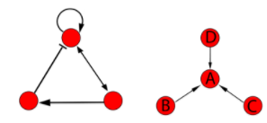
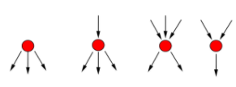
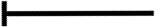
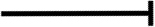
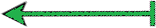
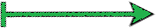
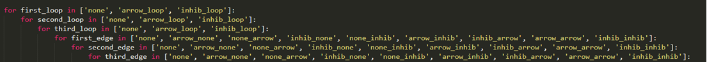
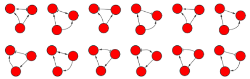

# Building Network Architecture

Folder | Content
-------|--------
Images | Various figures, diagrams and images used in this README file
src | The Source Code to generate 3 node motifs written in python
Motifs | Enumeration of all generated motifs[COMING SOON]

## Table of Contents
- Network Theory
- Network Architecture of Economy, Flexibility, Robustness(EFR)
- Theory for Three-Node Network Motifs
- Code Logic
- Literature

## Network Theory
A network consists of nodes (e.g. genes, proteins, neurons etc.), and their interactions are represented as the edges connecting the nodes. Edges can be undirected and denoted as lines, or have directionality attributes such as arrows; the directed edges may be excitatory or inhibitory (Figure 2, left). Structural properties of networks include degree (k), degree distribution(P(k)) and centrality [citation]. These properties describe patterns of node connectivity. For example, if node A has degree of k=3, node A would be connected to 3 other nodes (Figure 2, right) (citation). Individual node connectivity could facilitate integration or redistribution of information (Figure 3).

__Figure 1__

Possible kinds of connections among nodes in a network: arrows indicate excitation, rectilinear ends indicate inhibition. Self-activation and self-inhibition are also possible. Degree of a node is equal to the number of connections it has to other nodes, whether those connections are excitatory, inhibitory, incoming or outgoing. Here node A has degree of 3, and nodes B, C, D have degree of 1.

__Figure 2__

Nodes with more outputs than inputs tend to distribute incoming information across the downstream network, potentially activating many effectors in response to few stimuli. Modes with more inputs than outputs tend to integrate the incoming information, potentially activating a single coherent behavior in response to a complex set of stimuli.

## Network Architecture of Economy, Flexibility, Robustness (EFR)
__Economy__: Economic networks are frugal in structure and function as to conserve matter-energy. We suggest that networks conferring economy have relatively few nodes that are arranged in sequence for faster operation. This minimizes redundancy in network architecture, reducing robustness. Unbranched structure leads to a single input/single output pattern, reducing flexibility.

__Flexibility__: Flexible networks are defined as being able to respond to a greater number of stimuli with a greater number of outputs (downstream effectors). A node that has only one output can have only one response regardless of the stimuli. Similarly, a node that has only one input can only respond to one perceived signal regardless of the responses. However, a node with multiple inputs and/or outputs has the flexibility to respond to a number of stimuli with as many or more reactions. Based on the number of combinations of potential input/output stimuli for a given network, some network architectures may be classified as relatively more flexible than others.

__Robustness__: A robust network displays characteristics of redundancy, resulting in the ability to withstand numerous types of potentially environmental stimuli without failure. If one of the redundant nodes is damaged, the other redundant copies can still fulfill its function. Additionally, robustness can be conferred via an elevated number of distributors (kout>0 and Kin=0 or 1; Sergei and Maslov, 2005). This, however, may result in inefficiencies, i.e. longer time taken by a signal to traverse a network due to multiple paths that can be taken.

1. Robustness can be quantified in structural terms, i.e. when a NW has a hub with many input and outputs, therefore conferring high flexibility. Eliminating that node/hub through damage results in a significant loss of flexibility. Thus by definition such structure is not robust.

1. Robustness can also be quantified in operational terms: symmetric and well-connected networks possess redundant paths for information flow.

All three characteristics represent types of organismal persistence strategies used for evolution and survival and consequently may be viewed as a trade off among each other: if a network loses one attribute, it may gain another. 	

## Theory for Three-Node Network Motifs
To explore how evolution of EFR can be supported via patterns of node connectivity, we modeled the simplest case of a three-node network. Three-node motifs have already received significant attention in the literature [1&2], thus providing us with ample ground to build on. We wrote a Python script that automates exhaustive enumeration of all possible three-node network motifs (total of 19,683; Figure 7). We assume that the top node receives the input signal, and eliminate all networks where a node is not connected to any other nodes. Types of interactions incorporated include self inhibition, self activation, activation and inhibition.

Interaction symbol | Interaction Type
-------------------|-----------------
 | none
 | arrow_none
 | none_arrow
 | inhib_none
 | none_inhib
 | arrow_inhib
 | inhib_arrow
 | arrow_arrow
 | inhib_inhib

Many of the resultant motifs turn out to be redundant due to network symmetry. The remaining motifs can be grouped in terms of their likely dynamic patterns of output: always on, on-off, and oscillators with various period.

## Code Logic
### Number of theoretical motifs
1. There are 3 possibilities: self activation, self inhibition or nothing for each loop among 3 nodes
1. There are 9 possible interactions  for each node and 3 nodes
1. Total number of theoretical motifs becomes __[(3^3)\*(9^3)] = 19,683 motifs__
### Number of theoretical motifs that are fully connected
1. The possibility of having nothing as an interaction is eliminated
  1. Total possible interactions = 8 and 3 nodes
1. However nothing can still be possible as a loop on a node because that doesn’t affect all three nodes being connected.
  1. Total possible loops = 3 and 3 nodes
1. For at least 2 edges connected: __[(3^3)\*(8\*8\*1)\*3] = 5,184 motifs__
1. For all 3 edges connected: __[(3^3)\*(8^3)] = 13, 824 motifs__
1. Sum of 2 edge connectivity and 3 edge connectivity is equal to theoretical number of fully connected motifs __(13,824 + 5,184 = 19,008)__
### Number of theoretical motifs not all connected
1. Should be the difference of all possible motifs() and all connected possible motifs().
1. 19,683 - 19,008 = __675 motifs__

Example of the few figures generated by the python code, visualized using Cytoscape, a network analysis software.

## Literature
1. Barabasi, A. L., & Oltvai, Z. N. (2004). Network biology: understanding the cell's functional organization. Nature reviews genetics, 5(2), 101-113.
2. Shen-Orr, S. S., Milo, R., Mangan, S., & Alon, U. (2002). Network motifs in the transcriptional regulation network of Escherichia coli. Nature genetics, 31(1),64-68.   
